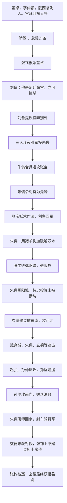
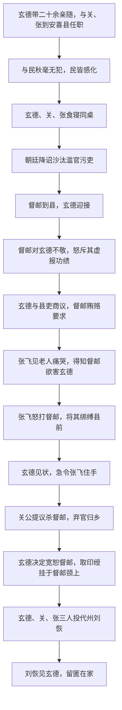
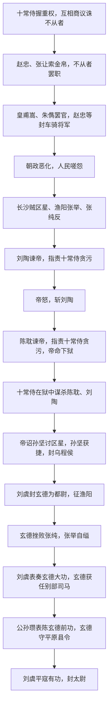
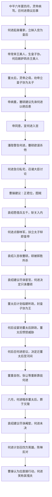
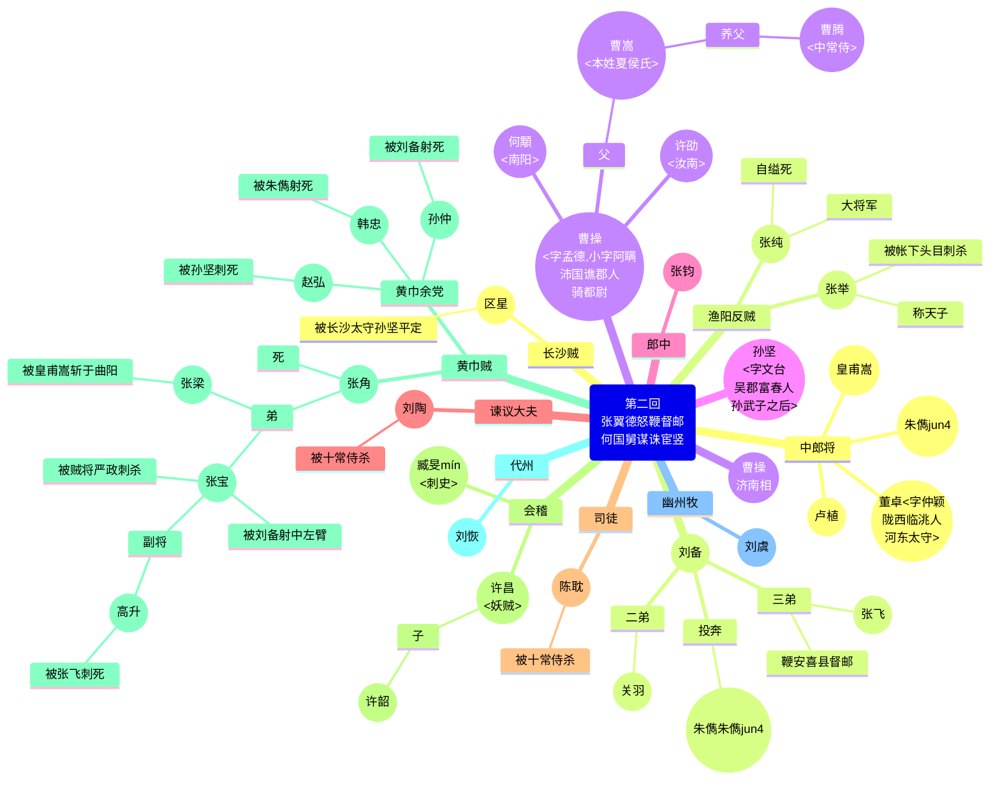

## 三国演义
### 第二回 张翼德怒鞭督邮　何国舅谋诛宦竖

```mermaid
graph TD
    A[董卓，字仲颖，陇西临洮人。官拜河东太守] --> B[骄傲 ，怠慢刘备]--> C[张飞欲杀董卓]
    C --> D[刘备：他是朝廷命官，岂可擅杀] --> E[刘备提议投奔别处]
    E --> F[三人连夜引军投朱儁] --> G[朱儁合兵进攻张宝]
%%    B --> C[曹操攻打张梁]
%%    H --> I[皇甫嵩战胜张梁，朝廷表彰]
    G --> H[朱儁令刘备为先锋] --> I[张宝妖术作法，刘备回军]
    I --> J[朱儁：用猪羊狗血破解妖术] --> K[张宝败逃阳城，遭围攻]--> L[朱儁围阳城，韩忠投降未被接纳]
    L --> M[玄德建议撤东南，攻西北]--> N[贼弃城，朱儁、玄德等追击]--> O[赵弘、孙仲反攻，孙坚增援]
    O --> P[孙坚攻南门，贼众溃败] --> Q[朱儁班师回京，封车骑将军]
    Q --> R[玄德未获封授，张钧上书建议斩十常侍] --> S[张钧被逐，玄德最终获授县尉]
```

```mermaid
graph TD
    A[玄德带二十余亲随，与关、张到安喜县任职] --> B[与民秋毫无犯，民皆感化]
    B --> C[玄德、关、张食寝同桌]
    C --> D[朝廷降诏沙汰滥官污吏]
    D --> E[督邮到县，玄德迎接]
    E --> F[督邮对玄德不敬，怒斥其虚报功绩]
    F --> G[玄德与县吏商议，督邮贿赂要求]
    G --> H[张飞见老人痛哭，得知督邮欲害玄德]
    H --> I[张飞怒打督邮，将其绑缚县前]
    I --> J[玄德见状，急令张飞住手]
    J --> K[关公提议杀督邮，弃官归乡]
    K --> L[玄德决定宽恕督邮，取印绶挂于督邮颈上]
    L --> M[玄德、关、张三人投代州刘恢]
    M --> N[刘恢见玄德，留匿在家]
```

```mermaid
graph TD
    A[十常侍握重权，互相商议诛不从者] --> B[赵忠、张让索金帛，不从者罢职]
    B --> C[皇甫嵩、朱儁罢官，赵忠等封车骑将军]
    C --> D[朝政恶化，人民嗟怨]
    D --> E[长沙贼区星、渔阳张举、张纯反]
    E --> F[刘陶谏帝，指责十常侍贪污]
    F --> G[帝怒，斩刘陶]
    G --> H[陈耽谏帝，指责十常侍贪污，帝命下狱]
    H --> I[十常侍在狱中谋杀陈耽、刘陶]
    I --> J[帝诏孙坚讨区星，孙坚获捷，封乌程侯]
    J --> K[刘虞封玄德为都尉，征渔阳]
    K --> L[玄德挫败张纯，张举自缢]
    L --> M[刘虞表奏玄德大功，玄德获任别部司马]
    M --> N[公孙瓒表陈玄德前功，玄德守平原县令]
    N --> O[刘虞平寇有功，封太尉]
```

```mermaid
graph TD
    A[中平六年夏四月，灵帝病笃，召何进商议后事] --> B[何进起身屠家，立妹入宫为皇后]
    B --> C[帝宠幸王美人，生皇子协，何后嫉妒鸩杀王美人]
    C --> D[董太后，灵帝之母，劝帝立皇子协为太子]
    D --> E[帝病重，蹇硕建议先诛何进以绝后患]
    E --> F[帝同意，宣何进入宫]
    F --> G[潘隐警告何进，蹇硕欲谋杀他]
    G --> H[何进急归私宅，召诸大臣讨论]
    H --> I[曹操建议：正君位，图贼]
    I --> J[袁绍愿借兵五千，斩关入内]
    J --> K[何进点御林军，扶立太子辩即皇帝]
    K --> L[袁绍入宫收蹇硕，硕被郭胜所杀]
    L --> M[袁绍建议尽诛宦官，何进决定只诛蹇硕]
    M --> N[董太后计划临朝听政，封皇子协为王]
    N --> O[何后设宴劝董太后辞政，董太后愤怒威胁]
    O --> P[何后召何进密议，决定迁董太后至河间]
    P --> Q[董重自刎，张让等重新靠拢何进]
    Q --> R[六月，何进暗杀董太后，葬于文陵]
    R --> S[袁绍建议尽诛阉宦，何进未决]
    S --> T[何进计划召四方英雄，陈琳反对]
    T --> U[曹操认为应直接行动，何进笑称其懦夫]
```

```mermaid
mindmap
  root(第二回<br>张翼德怒鞭督邮<br>何国舅谋诛宦竖)
    中郎将
      ((董卓<字仲颖<br>陇西临洮人<br>河东太守>))
      ((皇甫嵩))
      ((朱儁jun4))

      ((卢植))
    ((刘备))
      投奔
        ((朱儁朱儁jun4))
      二弟
        ((关羽))
      三弟
        ((张飞))
        鞭安喜县督邮
    ((曹操<br>济南相))
    ((孙坚<br><字文台<br>吴郡富春人<br>孙武子之后>))
    郎中
      ((张钧))
    谏议大夫
      ((刘陶))
        被十常侍杀
    司徒
      ((陈耽))
        被十常侍杀
    会稽
      ((许昌<br><妖贼>))
        子
          ((许韶))
      ((臧旻mín<br><刺史>))
    黄巾贼
      ((张角))
        死
        弟
          ((张宝))
            被刘备射中左臂
            副将
              ((高升))
                被张飞刺死
            被贼将严政刺杀
          ((张梁))
            被皇甫嵩斩于曲阳
      黄巾余党
        ((赵弘))
          被孙坚刺死
        ((韩忠))
          被朱儁射死
        ((孙仲))
          被刘备射死
    代州
      ((刘恢))
    幽州牧
      ((刘虞))
    长沙贼
      ((区星))
        被长沙太守孙坚平定
    渔阳反贼
      ((张举))
        称天子
        被帐下头目刺杀
      ((张纯))
        大将军
        自缢死
    ((曹操<br><字孟德,小字阿瞒<br>沛国谯郡人<br>骑都尉))
      父
        ((曹嵩<br><本姓夏侯氏>))
          养父
            ((曹腾<br><中常侍>))
      ((何顒<br><南阳>))
      ((许劭<br><汝南>))
```

