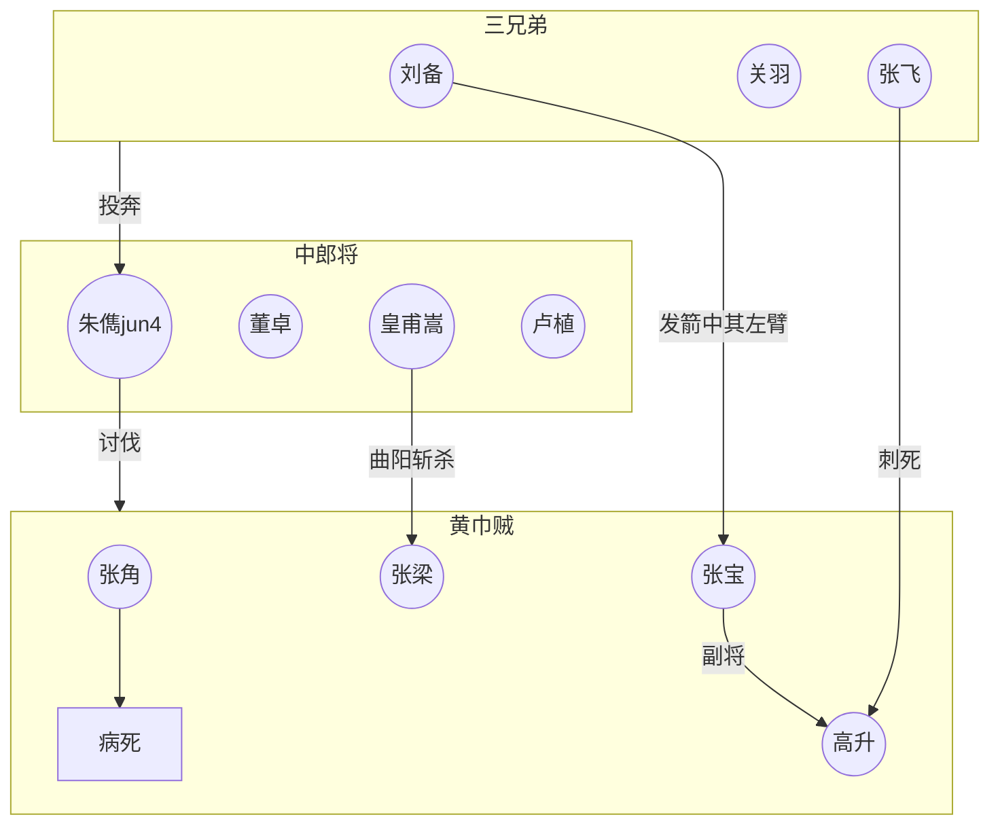
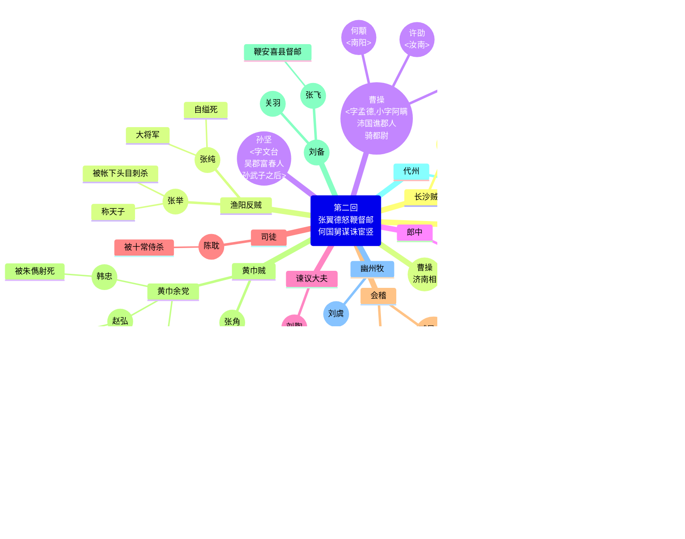

## 三国演义
### 第二回 张翼德怒鞭督邮　何国舅谋诛宦竖

```mermaid
flowchart TB
  subgraph SANXIONGDI[三兄弟]
    LIUBEI((刘备))
    GUANYU((关羽))
    ZHANGFEI((张飞))
  end

  SANXIONGDI --投奔--> ZHUJUN((朱儁))
  subgraph HUANGJINZEI[黄巾贼]
    ZAHNGJIAO((张角)) --> 病死
    ZHANGLIANG((张梁))
    ZHANGBAO((张宝))
    GAOSHEN((高升))
    ZHANGBAO --副将--> GAOSHEN
  end

  ZHUJUN --讨伐--> HUANGJINZEI

  ZHANGFEI --刺死--> GAOSHEN
  LIUBEI --发箭中其左臂--> ZHANGBAO

  subgraph ZHONGLANGJIANG[中郎将]
    DONGZHUO((董卓))
    HUANGPUSONG((皇甫嵩))
    ZHUJUN((朱儁jun4))
    LUZHI((卢植))
  end

  HUANGPUSONG --曲阳斩杀--> ZHANGLIANG

```

```mermaid
mindmap
  root(第二回<br>张翼德怒鞭督邮<br>何国舅谋诛宦竖)
    中郎将
      ((董卓<字仲颖<br>陇西临洮人<br>河东太守>))
      ((皇甫嵩))
      ((朱儁jun4))
      ((卢植))
    ((曹操<br>济南相))
    ((孙坚<br><字文台<br>吴郡富春人<br>孙武子之后>))
    郎中
      ((张钧))
    谏议大夫
      ((刘陶))
        被十常侍杀
    司徒
      ((陈耽))
        被十常侍杀
    会稽
      ((许昌<br><妖贼>))
        子
          ((许韶))
      ((臧旻mín<br><刺史>))
    黄巾贼
      ((张角))
        死
        弟
          ((张宝))
            被刘备射中左臂
            副将
              ((高升))
            被贼将严政刺杀
          ((张梁))
            被皇甫嵩斩于曲阳
      黄巾余党
        ((赵弘))
          被孙坚刺死
        ((韩忠))
          被朱儁射死
        ((孙仲))
          被刘备射死
    ((刘备))
      ((关羽))
      ((张飞))
        鞭安喜县督邮
    代州
      ((刘恢))
    幽州牧
      ((刘虞))
    长沙贼
      ((区星))
        被长沙太守孙坚平定
    渔阳反贼
      ((张举))
        称天子
        被帐下头目刺杀
      ((张纯))
        大将军
        自缢死
    ((曹操<br><字孟德,小字阿瞒<br>沛国谯郡人<br>骑都尉))
      父
        ((曹嵩<br><本姓夏侯氏>))
          养父
            ((曹腾<br><中常侍>))
      ((何顒<br><南阳>))
      ((许劭<br><汝南>))
```

