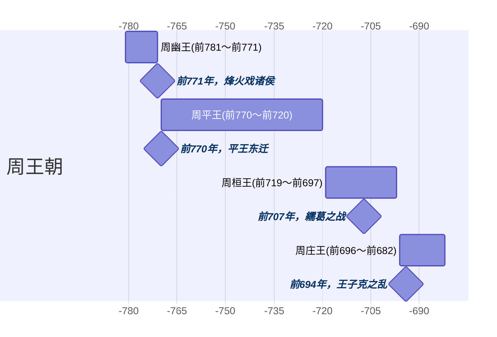

## 春秋大事记

```mermaid
---
config:
  themeCSS: '
    .grid .tick line{stroke:lightgray;stroke-dasharray:3;opacity:1;}
    .grid .tick text{font-size:16px;}
  '
  gantt:
    topAxis: true
    barHeight: 50
    leftPadding: 200
    fontSize: 16
    sectionFontSize: 30
    numberSectionStyles: 4
    axisFormat: "%Y"
---
gantt
  dateFormat X
  axisFormat %s

  section 周王朝
  周幽王(前781～前771): -781,-771
  前771年，烽火戏诸侯: milestone,m-771-zhou,-771,
  click m-771-zhou href "https://baike.baidu.com/item/%E7%83%BD%E7%81%AB%E6%88%8F%E8%AF%B8%E4%BE%AF/9127348"
  周平王(前770～前720): -770,-720
  前770年，平王东迁: milestone,m-770-zhou,-770,
  click m-770-zhou href "https://baike.baidu.com/item/%E5%B9%B3%E7%8E%8B%E4%B8%9C%E8%BF%81?fromModule=lemma_search-box"
  周桓王(前719～前697): -719,-697
  前707年，繻葛之战: milestone,m-707-zhou,-707,
  click m-707-zhou href "https://baike.baidu.com/item/%E7%B9%BB%E8%91%9B%E4%B9%8B%E6%88%98?fromModule=lemma_search-box"
  周庄王(前696～前682): -696,-682
  前694年，王子克之乱: milestone,m-694-zhou,-694,
  click m-694-zhou href "https://baike.baidu.com/item/%E7%8E%8B%E5%AD%90%E5%85%8B%E4%B9%8B%E4%B9%B1/1235439?fromModule=lemma_inlink"

  


```

