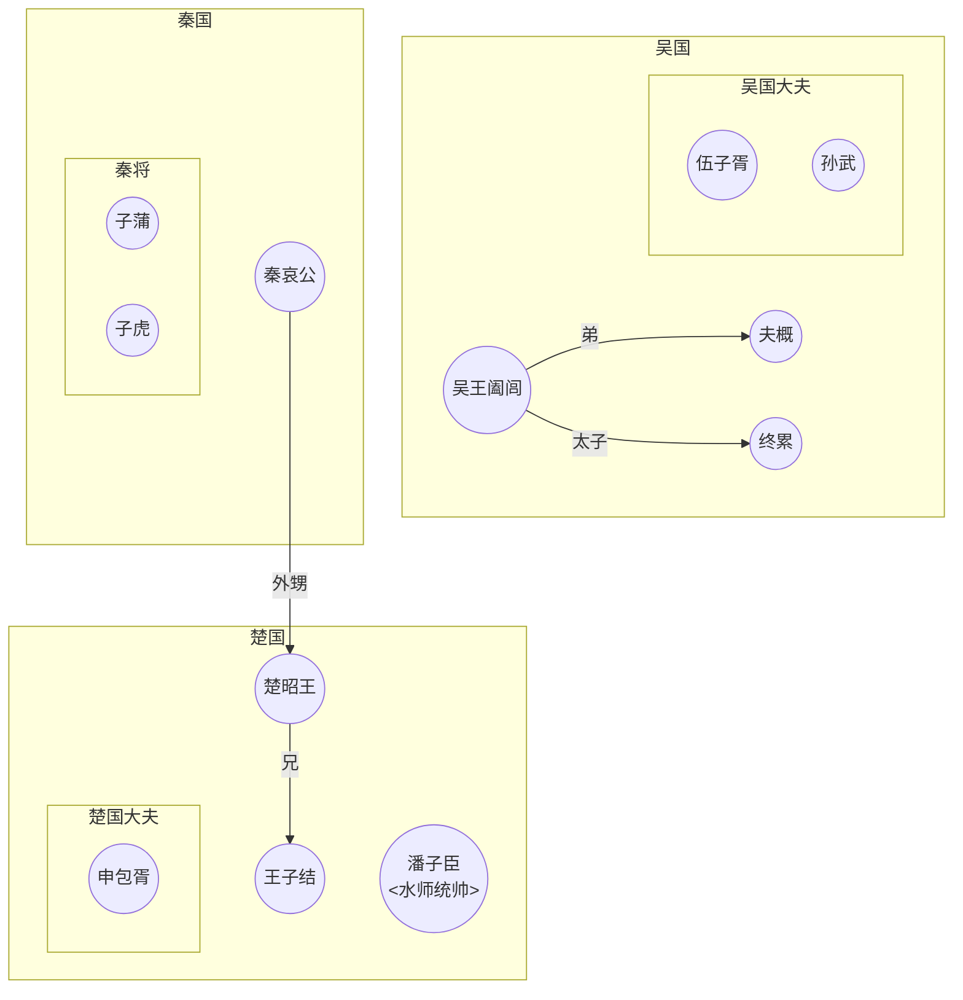

## 透过地理看历史（春秋篇）
### 第三十四章 申包胥救楚

```mermaid
---
config:
  themeCSS: '
    .grid .tick line{stroke:lightgray;stroke-dasharray:3;opacity:1;}
    .grid .tick text{font-size:16px;}
    .grid path {stroke-width: 0;}
  '
  gantt:
    titleTopMargin:
    topPadding:
    gridLineStartPadding: 
    topAxis: true
    barHeight: 50
    rightPadding:
    leftPadding: 200
    fontSize: 16
    sectionFontSize: 20
    numberSectionStyles: 4
    axisFormat: "%Y"
    useMaxWidth:
    weekday:
    barGap:
---
gantt
  dateFormat X
  axisFormat %s
  todayMarker off

  section 时间轴线
  楚昭王(前516～前489): -541,-529
  秦哀公(前536～前501): -536,-501
  前505年，秦救楚: milestone, -505,
  前504年，楚攻吴: milestone, -504,


```
#### 登场人物

```mermaid
graph TB
  subgraph 楚国
    direction TB
    CCZW((楚昭王))
    CWZS((王子申))
    CWZS((王子结))

    CCZW --兄--> CWZS

    subgraph 楚国大夫
      CSBX((申包胥))
    end

    CPZC((潘子臣<br><水师统帅>))

  end

  subgraph 吴国
    WHL((吴王阖闾))
    WFG((夫概))
    WHL --弟--> WFG

    WZL((终累))
    WHL --太子--> WZL

    subgraph 吴国大夫
      WWZX((伍子胥))
      WSW((孙武))
    end
  end

  subgraph 秦国
    QQAG((秦哀公))

    subgraph 秦将
      QZP((子蒲))
      QZH((子虎))
    end
  end

  QQAG --外甥--> CCZW

```
