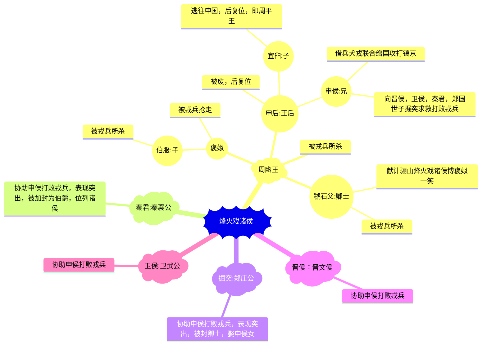

## 透过地理看历史（春秋篇）
### 第一章 烽火戏诸侯

```mermaid
---
config:
  themeCSS: '
    .grid .tick line{stroke:lightgray;stroke-dasharray:3;opacity:1;}
    .grid .tick text{font-size:16px;}
    .grid path {stroke-width: 0;}
  '
  gantt:
    titleTopMargin:
    topPadding:
    gridLineStartPadding: 
    topAxis: true
    barHeight: 50
    rightPadding:
    leftPadding: 200
    fontSize: 16
    sectionFontSize: 20
    numberSectionStyles: 4
    axisFormat: "%Y"
    useMaxWidth:
    weekday:
    barGap:
---
gantt
    dateFormat  X
    axisFormat %s
    todayMarker off

    section 烽火戏诸侯
    周幽王(前781～前771): -781,-771
    【前779】攻打褒国，得到褒姒: milestone, -779,
    【前778】褒姒生伯服，立为太子: milestone, -778,
    申后被废，原太子宜臼被废，逃往申国: milestone, -778,
    【前771】烽火戏诸侯，周幽王和太子伯服被杀，褒姒被戎兵抢走: milestone, -771,
```

```mermaid
mindmap
root))烽火戏诸侯((
  )周幽王(
    被戎兵所杀
    ((褒姒))
      被戎兵抢走
      ((伯服:子))
        被戎兵所杀
    ((申后:王后))
      被废，后复位
      ((宜臼:子))
        逃往申国，后复位，即周平王
      ((申侯:兄))
        借兵犬戎联合缯国攻打镐京
        向晋侯，卫侯，秦君，郑国世子掘突求救打败戎兵
    ((虢石父:卿士))
      献计骊山烽火戏诸侯博褒姒一笑
      被戎兵所杀
  )秦君:秦襄公(
    协助申侯打败戎兵，表现突出，被加封为伯爵，位列诸侯
  )掘突:郑庄公(
    协助申侯打败戎兵，表现突出，被封卿士，娶申侯女
  )晋侯：晋文侯(
    协助申侯打败戎兵
  )卫侯:卫武公(
    协助申侯打败戎兵
```