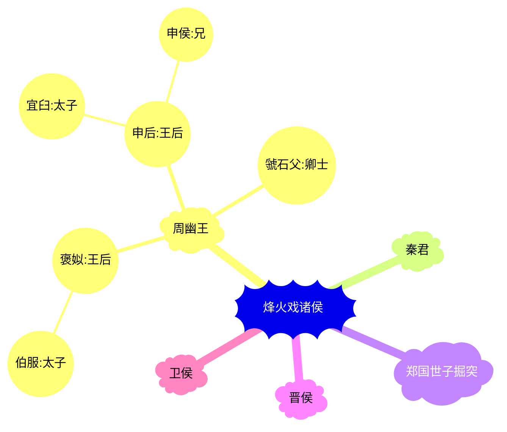
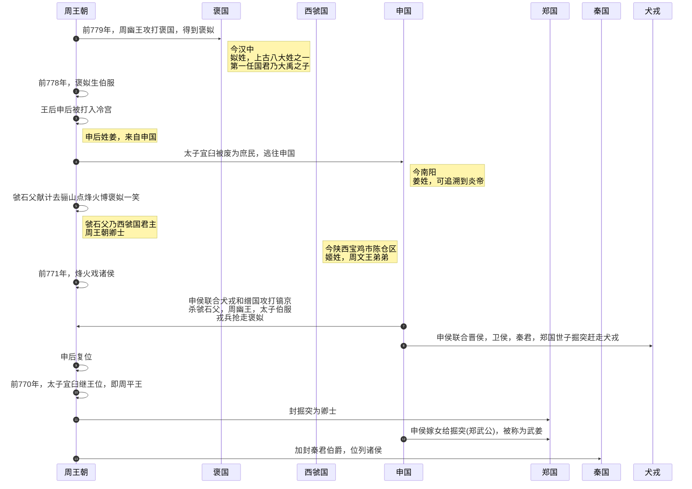

## 透过地理看历史（春秋篇）
### 第一章 烽火戏诸侯

```mermaid
---
config:
  themeCSS: '
    .grid .tick line{stroke:lightgray;stroke-dasharray:3;opacity:1;}
    .grid .tick text{font-size:16px;}
    .grid path {stroke-width: 0;} 
    .sectionTitle {font-weight:900;}
  '
  gantt:
    titleTopMargin:
    topPadding:
    gridLineStartPadding: 
    topAxis: true
    barHeight: 50
    rightPadding:
    leftPadding: 200
    fontSize: 16
    sectionFontSize: 22
    numberSectionStyles: 4
    axisFormat: "%Y"
    useMaxWidth:
    weekday:
    barGap:
---
gantt
    dateFormat  X
    axisFormat %s
    todayMarker off

    section 时间轴线
    周幽王(前781～前771): -781,-771
    前779年，周幽王攻打褒国，得到褒姒: milestone, -779,
%%    前778年，褒姒生伯服: milestone, -778,
    前771年，烽火戏诸侯: milestone, -771,
%%    周平王(前770～前720): -770,-720
    郑桓公(前806～前771): -806,-771
%%    郑武公(前770～前744): -770,-744
    晋文侯(前780～前746): -780,-746
    卫武公(前812～前758): -812,-758
    秦襄公(前777～前766): -777,-766
```

#### 登场人物

```mermaid
mindmap
root))烽火戏诸侯((
  )周幽王(
    ((褒姒:王后))
      ((伯服:太子))
    ((申后:王后))
      ((宜臼:太子))
      ((申侯:兄))
    ((虢石父:卿士))
  )秦君(
  )郑国世子掘突(
  )晋侯(
  )卫侯(
```

#### 主要事件

```mermaid
---
config:
  themeCSS: '
    .messageText {font-size: 20px;}
  '
  fontSize: 30
  sequence:
    noteAlign: left
    messageFontSize: 20
    noteFontSize: 20
---
sequenceDiagram
  autonumber

  participant 周王朝
  participant 褒国
  participant 西虢国
  participant 申国
  participant 郑国
  participant 秦国
  participant 犬戎

  周王朝 ->> 褒国:前779年，周幽王攻打褒国，得到褒姒
  Note right of 褒国:今汉中<br/>姒姓，上古八大姓之一<br/>第一任国君乃大禹之子
  周王朝 ->> 周王朝:前778年，褒姒生伯服
  周王朝 ->> 周王朝:王后申后被打入冷宫
  Note right of 周王朝:申后姓姜，来自申国
  周王朝 ->> 申国:太子宜臼被废为庶民，逃往申国
  Note right of 申国:今南阳<br/>姜姓，可追溯到炎帝
  周王朝 ->> 周王朝:虢石父献计去骊山点烽火博褒姒一笑
  Note right of 周王朝:虢石父乃西虢国君主<br/>周王朝卿士
  Note right of 西虢国:今陕西宝鸡市陈仓区<br/>姬姓，周文王弟弟
  周王朝 ->> 周王朝:前771年，烽火戏诸侯
  申国 ->> 周王朝:申侯联合犬戎和缯国攻打镐京<br/>杀虢石父，周幽王，太子伯服<br/>戎兵抢走褒姒
  申国 ->> 犬戎:申侯联合晋侯，卫侯，秦君，郑国世子掘突赶走犬戎
  周王朝 ->> 周王朝:申后复位
  周王朝 ->> 周王朝:前770年，太子宜臼继王位，即周平王
  周王朝 ->> 郑国:封掘突为卿士
  申国 ->> 郑国:申侯嫁女给掘突(郑武公)，被称为武姜
  周王朝 ->> 秦国:加封秦君伯爵，位列诸侯
```