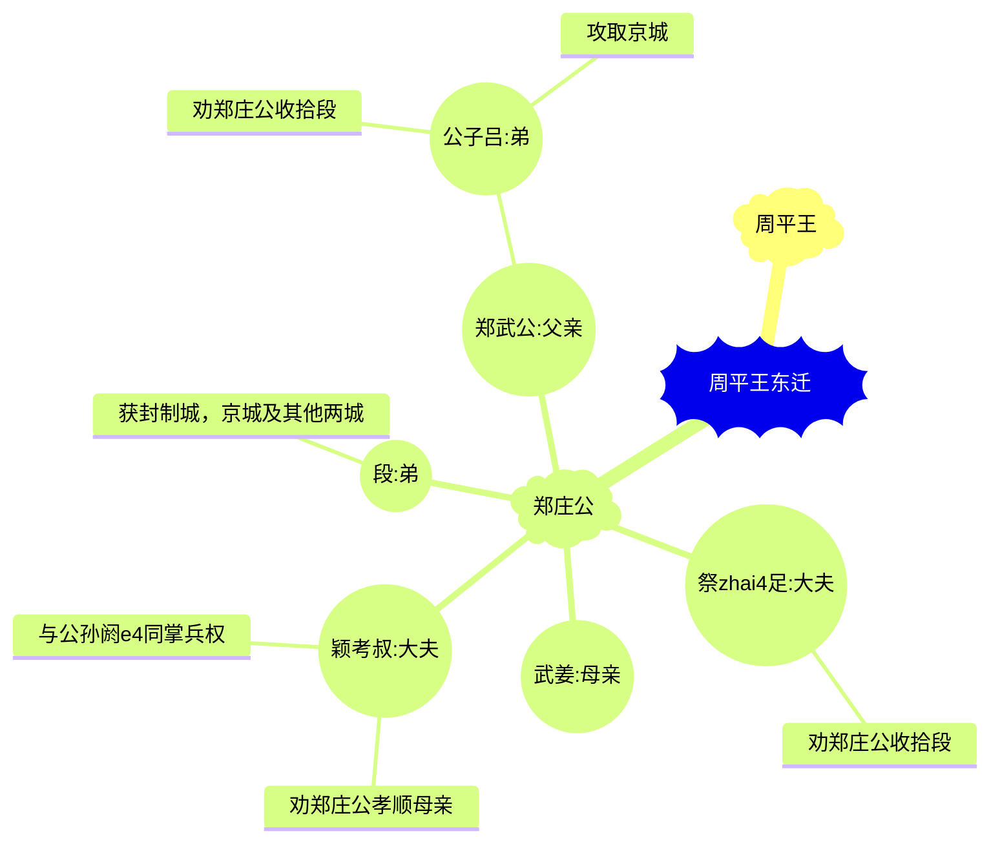

## 透过地理看历史（春秋篇）
### 第二章 周平王东迁

```mermaid
---
config:
  themeCSS: '
    .grid .tick line{stroke:lightgray;stroke-dasharray:3;opacity:1;}
    .grid .tick text{font-size:16px;}
    .grid path {stroke-width: 0;}
  '
  gantt:
    titleTopMargin:
    topPadding:
    gridLineStartPadding: 
    topAxis: true
    barHeight: 50
    rightPadding:
    leftPadding: 200
    fontSize: 16
    sectionFontSize: 20
    numberSectionStyles: 4
    axisFormat: "%Y"
    useMaxWidth:
    weekday:
    barGap:
---
gantt
    dateFormat  X
    axisFormat %s
    todayMarker off
    
    section 周平王东迁
    周平王(前770～前720）：姬宜臼: -770,-720
    【前770】迁都洛邑（镐京东边）: milestone, -770,
    郑武公(前770～前744): -770,-744
    郑庄公(前743～前701）：寤生: -743,-701
    【前722】太叔约武姜偷袭新郑: milestone, -722,
    兵败逃往共国(共叔段): milestone, -722,
    郑庄公与武姜黄泉相见: milestone, -722,
    
```

```mermaid
mindmap
root))周平王东迁((
  )周平王( 
  )郑庄公(   
    ((祭zhai4足:大夫))
      劝郑庄公收拾段
    ((颖考叔:大夫))
      劝郑庄公孝顺母亲
      与公孙阏e4同掌兵权
    ((武姜:母亲))
    ((段:弟))
      获封制城，京城及其他两城
    ((郑武公:父亲))
      ((公子吕:弟))
        劝郑庄公收拾段
        攻取京城
```