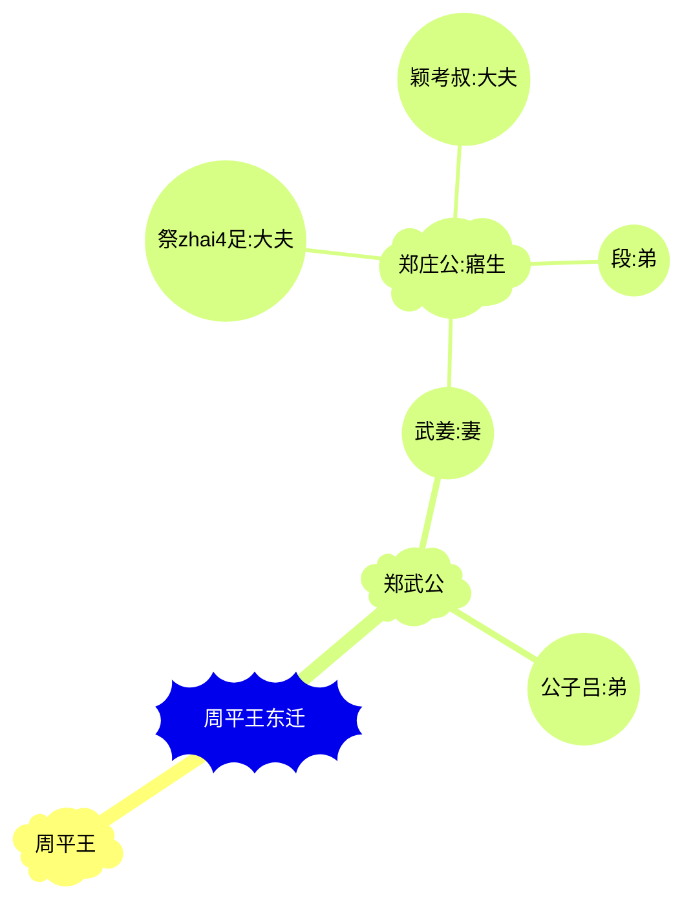
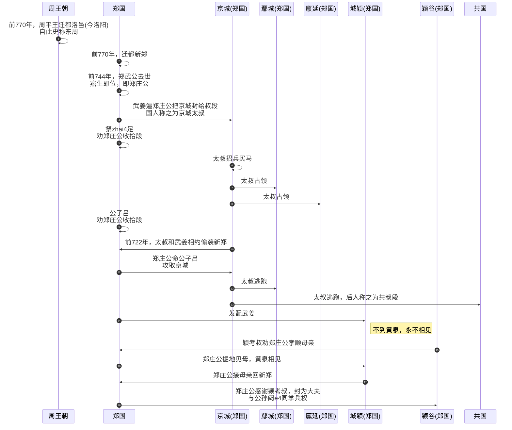

## 透过地理看历史（春秋篇）
### 第二章 周平王东迁

```mermaid
---
config:
  themeCSS: '
    .grid .tick line{stroke:lightgray;stroke-dasharray:3;opacity:1;}
    .grid .tick text{font-size:16px;}
    .grid path {stroke-width: 0;} 
    .sectionTitle {font-weight:900;}
  '
  gantt:
    titleTopMargin:
    topPadding:
    gridLineStartPadding: 
    topAxis: true
    barHeight: 50
    rightPadding:
    leftPadding: 200
    fontSize: 16
    sectionFontSize: 22
    numberSectionStyles: 4
    axisFormat: "%Y"
    useMaxWidth:
    weekday:
    barGap:
---
gantt
    dateFormat  X
    axisFormat %s
    todayMarker off
    
    section 时间轴线
    周平王(前770～前720）：姬宜臼: -770,-720
    前770年，周平王迁都洛邑(今洛阳)，自此史称东周: milestone, -770,
    郑武公(前770～前744): -770,-744
    郑庄公(前743～前701）：寤生: -743,-701
    前722年，太叔和武姜相约偷袭新郑: milestone, -722,
```

#### 登场人物

```mermaid
mindmap
root))周平王东迁((
  )周平王( 
  )郑武公(
    ((武姜:妻))
      )郑庄公:寤生(  
        ((祭zhai4足:大夫))
        ((颖考叔:大夫))
        ((段:弟))
    ((公子吕:弟))
```

#### 主要事件

```mermaid
---
config:
  themeCSS: '
    .messageText {font-size: 20px;}
  '
  fontSize: 30
  sequence:
    noteAlign: left
    messageFontSize: 20
    noteFontSize: 20
---
sequenceDiagram
  autonumber

  participant 周王朝
  participant 郑国
  participant 京城(郑国)
  participant 鄢城(郑国)
  participant 廪延(郑国)
  participant 城颖(郑国)
  participant 颖谷(郑国)
  participant 共国

  周王朝 ->> 周王朝:前770年，周平王迁都洛邑(今洛阳)<br/>自此史称东周
  郑国 ->> 郑国:前770年，迁都新郑
  郑国 ->> 郑国:前744年，郑武公去世<br/>寤生即位，即郑庄公
  郑国 ->> 京城(郑国):武姜逼郑庄公把京城封给叔段<br/>国人称之为京城太叔
  郑国 ->> 郑国:祭zhai4足<br/>劝郑庄公收拾段
  京城(郑国) ->> 京城(郑国):太叔招兵买马
  京城(郑国) ->> 鄢城(郑国):太叔占领
  京城(郑国) ->> 廪延(郑国):太叔占领
  郑国 ->> 郑国:公子吕<br/>劝郑庄公收拾段
  京城(郑国) ->> 郑国:前722年，太叔和武姜相约偷袭新郑
  郑国 ->> 京城(郑国):郑庄公命公子吕<br/>攻取京城
  京城(郑国) ->> 鄢城(郑国):太叔逃跑
  京城(郑国) ->> 共国:太叔逃跑，后人称之为共叔段
  郑国 ->> 城颖(郑国):发配武姜
  note right of 城颖(郑国):不到黄泉，永不相见
  颖谷(郑国) ->> 郑国:颖考叔劝郑庄公孝顺母亲
  郑国 ->> 城颖(郑国):郑庄公掘地见母，黄泉相见
  城颖(郑国) ->> 郑国:郑庄公接母亲回新郑
  郑国 ->> 颖谷(郑国):郑庄公感谢颖考叔，封为大夫<br/>与公孙阏e4同掌兵权
```