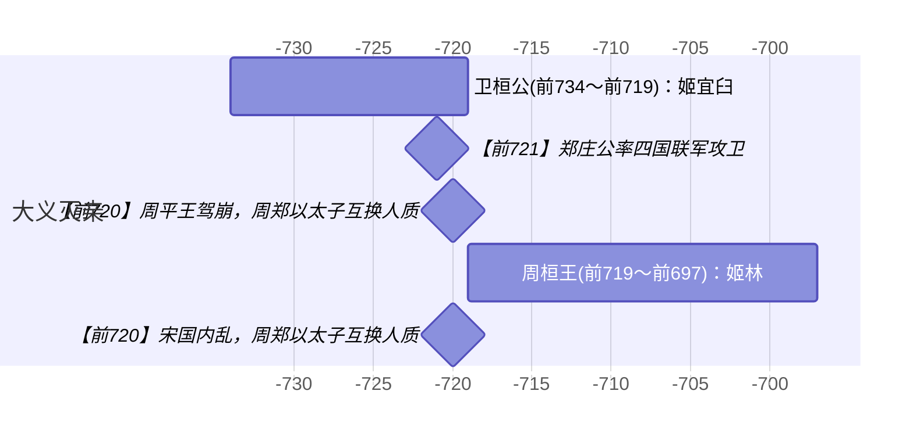

## 透過地理看历史（春秋篇）
### 第三章 大义灭亲

```mermaid
---
config:
  themeCSS: '
    .grid .tick line{stroke:lightgray;stroke-dasharray:3;opacity:1;}
    .grid .tick text{font-size:16px;}
    .grid path {stroke-width: 0;}
  '
  gantt:
    titleTopMargin:
    topPadding:
    gridLineStartPadding: 
    topAxis: true
    barHeight: 50
    rightPadding:
    leftPadding: 200
    fontSize: 16
    sectionFontSize: 20
    numberSectionStyles: 4
    axisFormat: "%Y"
    useMaxWidth:
    weekday:
    barGap:
---
gantt
    dateFormat  X
    axisFormat %s
    todayMarker off

    section 大义灭亲
    卫桓公(前734～前719)：姬宜臼: -734,-719
    【前721】郑庄公率四国联军攻卫: milestone, -721,
    【前720】周平王驾崩，周郑以太子互换人质: milestone, -720,
    周桓王(前719～前697)：姬林: -719,-697
    【前720】宋国内乱，周郑以太子互换人质: milestone, -720,
```