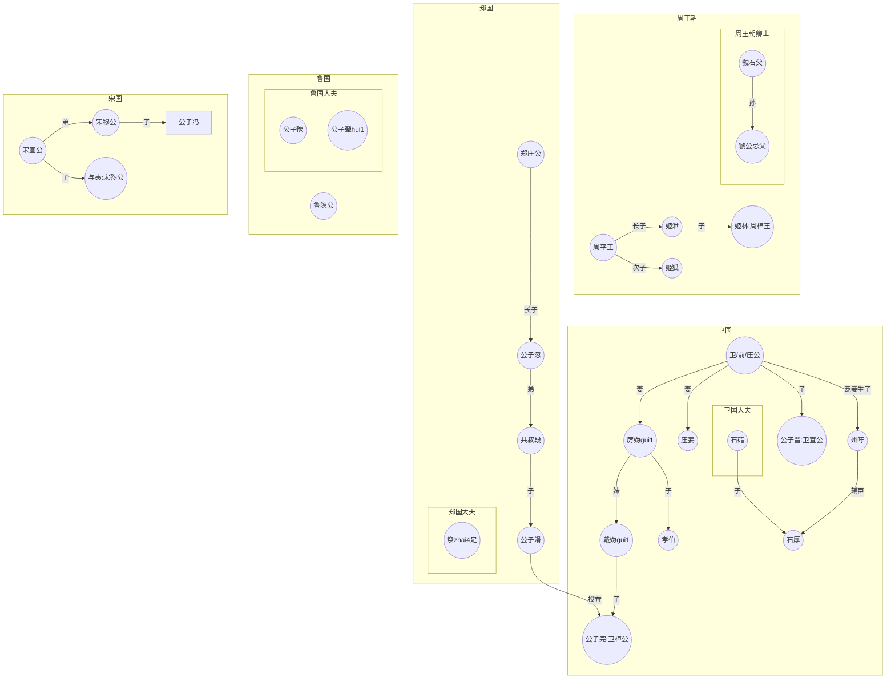
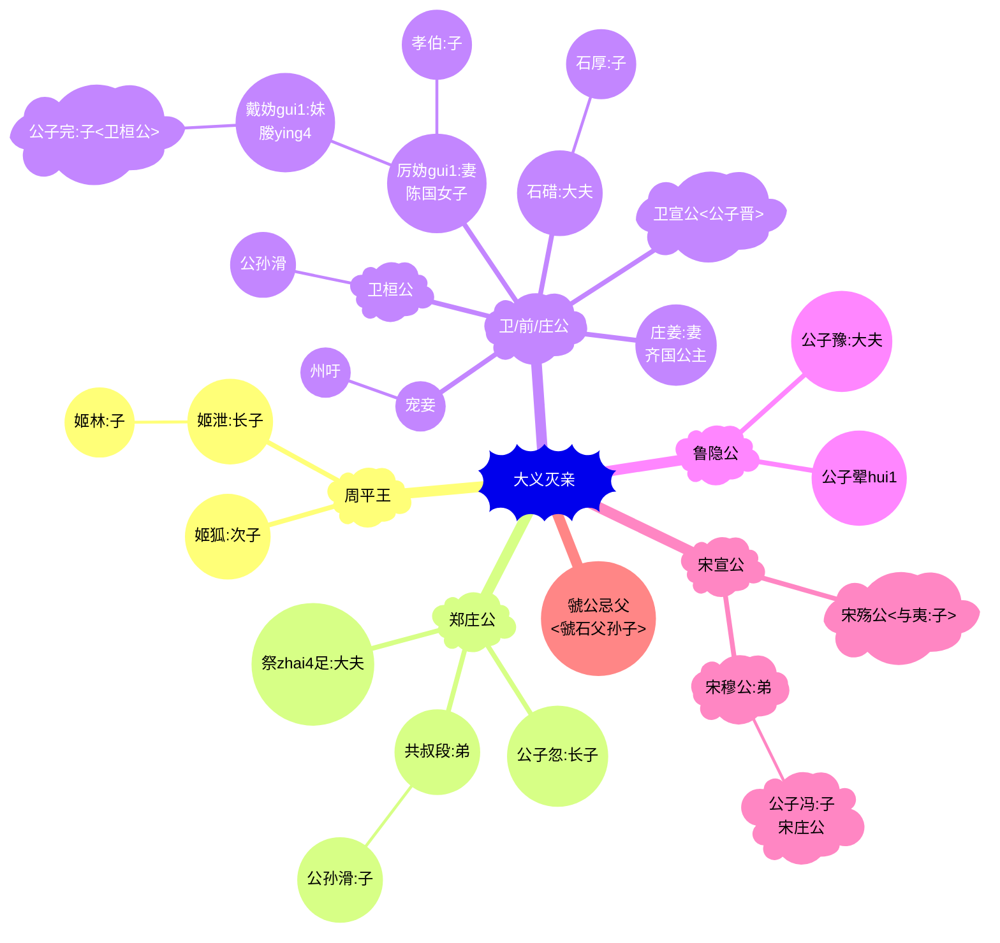
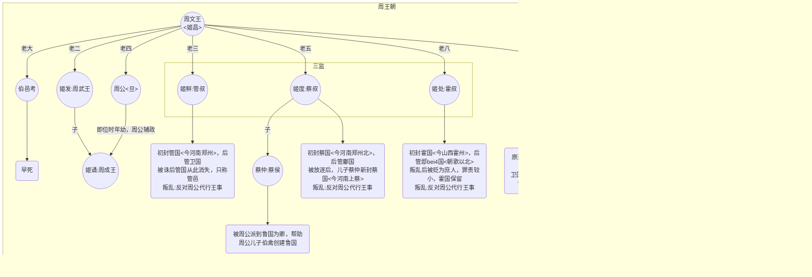
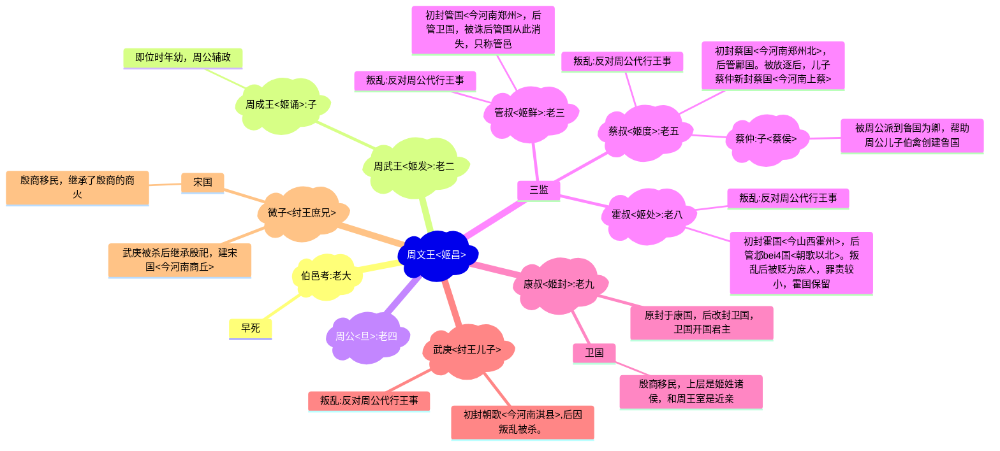
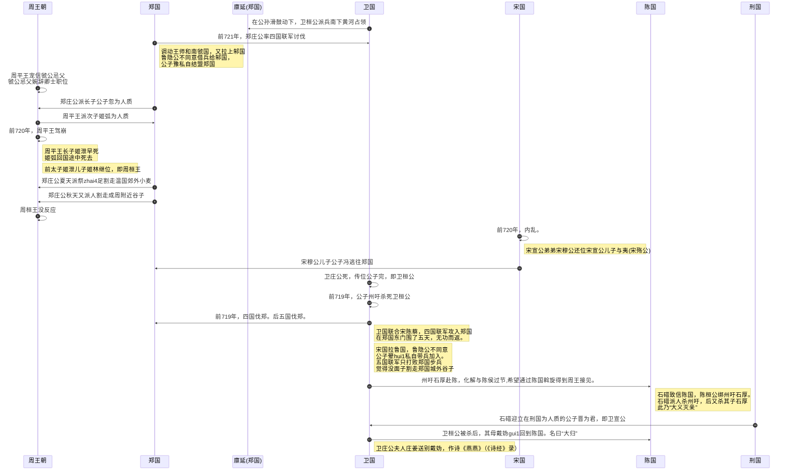

## 透过地理看历史（春秋篇）
### 第三章 大义灭亲

```mermaid
---
config:
  themeCSS: '
    .grid .tick line{stroke:lightgray;stroke-dasharray:3;opacity:1;}
    .grid .tick text{font-size:16px;}
    .grid path {stroke-width: 0;}
  '
  gantt:
    titleTopMargin:
    topPadding:
    gridLineStartPadding: 
    topAxis: true
    barHeight: 50
    rightPadding:
    leftPadding: 200
    fontSize: 16
    sectionFontSize: 20
    numberSectionStyles: 4
    axisFormat: "%Y"
    useMaxWidth:
    weekday:
    barGap:
---
gantt
  dateFormat X
  axisFormat %s
  todayMarker off

  section 时间轴线
  郑庄公(前743～前701)：寤生: -743,-701
  前721年，郑庄公率四国联军讨伐攻卫: milestone, -721,
  前720年，周平王驾崩: milestone, -720,
  周桓王(前719～前697)：姬林: -719,-697
  卫/前/庄公(前757～前735): -757,-735
  卫桓公(前734～前719)：姬宜臼: -734,-719
  前719年，公子州吁杀死卫桓公: milestone, -719,
  卫宣公(前718～前700): -718,-700
  宋宣公(前747～前729): -747,-729
  宋穆公(前728～前720): -728,-720
  前720年，宋国内乱，公子冯逃往郑国: milestone, -720,
  宋殇公(前719～前711): -719,-711
  宋庄公(前710～前692): -710,-692
```

```mermaid
graph TB
  subgraph 周王朝
    ZPW((周平王)) -- 长子 -->  JX((姬泄)) --子-->JL((姬林:周桓王))
    ZPW((周平王)) -- 次子 -->  JH((姬狐))
    subgraph 周王朝卿士
      GSH((虢石父)) --孙--> GSJF((虢公忌父))
    end
  end

  subgraph 郑国
    ZZG((郑庄公)) --长子--> GZH((公子忽)) --弟--> GSD((共叔段)) --子--> GZH1((公子滑)) 
    subgraph 郑国大夫
      ZZ((祭zhai4足))
    end
  end

  GZH1 --投奔--> WHG

  subgraph 卫国
    WZG((卫/前/庄公)) --妻--> ZJ((庄姜))
    WZG((卫/前/庄公)) --妻--> LG((厉妫gui1)) --妹--> DG((戴妫gui1))
    LG((厉妫gui1)) --子--> XB((孝伯))
    DG((戴妫gui1)) --子--> WHG((公子完:卫桓公))
    WZG((卫/前/庄公)) --子--> GZJ((公子晋:卫宣公))

    WZG((卫/前/庄公)) --宠妾生子--> ZY((州吁))

    subgraph 卫国大夫
      SQ((石碏))
    end
    SQ --子--> SH((石厚))

    ZY --辅臣--> SH
  end

  subgraph 鲁国
    LYG((鲁隐公))
    subgraph 鲁国大夫
      GZY((公子豫))
      GZH2((公子翚hui1))
    end
  end

  subgraph 宋国
    SXG((宋宣公)) --弟--> SMG((宋穆公)) --子--> 公子冯
    SXG((宋宣公)) --子--> SSG((与夷:宋殇公)) 
  end
```

#### 登场人物

```mermaid
mindmap
root))大义灭亲((
  )周平王(
    ((姬泄:长子))
      ((姬林:子))
    ((姬狐:次子))
  )郑庄公(
    ((公子忽:长子))
    ((共叔段:弟))
      ((公孙滑:子))
    ((祭zhai4足:大夫))
  )卫/前/庄公(
    ((庄姜:妻<br>齐国公主))
    ((厉妫gui1:妻<br>陈国女子))
      ((孝伯:子))
      ((戴妫gui1:妹<br>媵ying4))
        )公子完:子<卫桓公>(
    ((宠妾))
      ((州吁))
    ((石碏:大夫))
      ((石厚:子))
    )卫桓公(
      ((公孙滑))
    )卫宣公<公子晋>(
  )鲁隐公(
    ((公子豫:大夫))
    ((公子翚hui1))
  )宋宣公(
    )宋殇公<与夷:子>(
    )宋穆公:弟(
      )公子冯:子<br>宋庄公(
  ((虢公忌父<br><虢石父孙子>))
```

```mermaid
graph TB
  subgraph 周王朝
    ZWW((周文王<br/><姬昌>)) -- 老大 -->  BYK((伯邑考)) --> BYKZS(早死)
    ZWW -- 老二 -->  JF((姬发:周武王)) -- 子 -->  JS((姬诵:周成王))
    ZWW -- 老四 -->  ZGD((周公<旦>))
    ZGD --即位时年幼，周公辅政--> JS
    subgraph 三监
      JX((姬鲜:管叔))
      JD((姬度:蔡叔))
      JC((姬处:霍叔))
    end
    ZWW -- 老三 -->  JX
    ZWW -- 老五 -->  JD-- 子 -->  JZ((蔡仲:蔡侯))
    ZWW -- 老八 -->  JC

    JX --> JXBS(初封管国<今河南郑州>，后管卫国<br/>被诛后管国从此消失，只称管邑<br/>叛乱:反对周公代行王事)
    JD --> JDFZ(初封蔡国<今河南郑州北>，后管鄘国<br/>被放逐后，儿子蔡仲新封蔡国<今河南上蔡><br/>叛乱:反对周公代行王事)
    JZ --> JZLG(被周公派到鲁国为卿，帮助周公儿子伯禽创建鲁国)
    JC -->  JCBB(初封霍国<今山西霍州>，后管邶bei4国<朝歌以北><br/>叛乱后被贬为庶人，罪责较小，霍国保留<br/>叛乱:反对周公代行王事)

    ZWW -- 老九 -->  JF1((姬封:康叔)) --> WGGJ(原封于康国，后改封卫国，卫国开国君主<br/>卫国:殷商移民，上层是姬姓诸侯，和周王室是近亲)
    
    WG((武庚)) --> WGBX(初封朝歌<今河南淇县>,后因叛乱被杀<br/>叛乱:反对周公代行王事)
    WZ((微子)) --> WZSG(武庚被杀后继承殷祀，建宋国<今河南商丘><br/>宋国:殷商移民，继承了殷商的商火)
  end

  ZW((纣王)) --子--> WG
  ZW((纣王)) --庶兄--> WZ

```

##### 附:卫国来历

```mermaid
mindmap
root)周文王<姬昌>(
  )伯邑考:老大(
    早死
  )周武王<姬发>:老二(
    )周成王<姬诵>:子(
      即位时年幼，周公辅政
  )周公<旦>:老四(
  三监
    )管叔<姬鲜>:老三(
      叛乱:反对周公代行王事
      初封管国<今河南郑州>，后管卫国，被诛后管国从此消失，只称管邑
    )蔡叔<姬度>:老五(
      叛乱:反对周公代行王事
      初封蔡国<今河南郑州北>，后管鄘国。被放逐后，儿子蔡仲新封蔡国<今河南上蔡>
      )蔡仲:子<蔡侯>(
        被周公派到鲁国为卿，帮助周公儿子伯禽创建鲁国
    )霍叔<姬处>:老八(
      叛乱:反对周公代行王事
      初封霍国<今山西霍州>，后管邶bei4国<朝歌以北>。叛乱后被贬为庶人，罪责较小，霍国保留
  )康叔<姬封>:老九(
    原封于康国，后改封卫国，卫国开国君主
    卫国
      殷商移民，上层是姬姓诸侯，和周王室是近亲
  )武庚<纣王儿子>(
    初封朝歌<今河南淇县>,后因叛乱被杀。
    叛乱:反对周公代行王事
  )微子<纣王庶兄>(
    武庚被杀后继承殷祀，建宋国<今河南商丘>
    宋国
      殷商移民，继承了殷商的商火
```

#### 主要事件

```mermaid
---
config:
  themeCSS: '
    .messageText {font-size: 20px;}
  '
  fontSize: 30
  sequence:
    noteAlign: left
    messageFontSize: 20
    noteFontSize: 20
---
sequenceDiagram
  autonumber

  participant 周王朝
  participant 郑国
  participant 廪延(郑国)
  participant 卫国
  participant 宋国
  participant 陈国

  卫国 ->> 廪延(郑国):在公孙滑鼓动下，卫桓公派兵南下黄河占领
  郑国 ->> 卫国:前721年，郑庄公率四国联军讨伐
  note right of 郑国:调动王师和南虢国，又拉上邾国<br/>鲁隐公不同意借兵给邾国，<br/>公子豫私自结盟郑国

  周王朝 ->> 周王朝:周平王宠信虢公忌父<br/>虢公忌父婉辞卿士职位

  郑国 ->> 周王朝:郑庄公派长子公子忽为人质
  周王朝 ->> 郑国:周平王派次子姬弧为人质
  周王朝 ->> 周王朝:前720年，周平王驾崩
  note right of 周王朝:周平王长子姬泄早死<br>姬弧回国途中死去
  note right of 周王朝:前太子姬泄儿子姬林继位，即周桓王

  郑国 ->> 周王朝:郑庄公夏天派祭zhai4足割走温国郊外小麦
  郑国 ->> 周王朝:郑庄公秋天又派人割走成周附近谷子
  周王朝 ->> 周王朝:周桓王没反应

  宋国 ->> 宋国:前720年，内乱。
  note right of 宋国:宋宣公弟弟宋穆公还位宋宣公儿子与夷(宋殇公)
  宋国 ->> 郑国:宋穆公儿子公子冯逃往郑国

  卫国 ->> 卫国:卫庄公死，传位公子完，即卫桓公
  卫国 ->> 卫国:前719年，公子州吁杀死卫桓公
  卫国 ->> 郑国:前719年，四国伐郑。后五国伐郑。
  note right of 卫国:卫国联合宋陈蔡，四国联军攻入郑国<br/>在郑国东门围了五天，无功而返。
  note right of 卫国:宋国拉鲁国，鲁隐公不同意<br/>公子翚hui1私自带兵加入。<br/>五国联军只打败郑国步兵<br/>觉得没面子割走郑国城外谷子

  卫国 ->> 陈国:州吁石厚赴陈，化解与陈侯过节,希望通过陈国斡旋得到周王接见。
  note right of 陈国:石碏致信陈国，陈桓公绑州吁石厚。<br/>石碏派人杀州吁，后又杀其子石厚<br/>此乃“大义灭亲”
  刑国 ->> 卫国:石碏迎立在刑国为人质的公子晋为君，即卫宣公

  卫国 ->> 陈国:卫桓公被杀后，其母戴妫gui1回到陈国。名曰“大归”
  note right of 卫国:卫庄公夫人庄姜送别戴妫，作诗《燕燕》（《诗经》录）
```