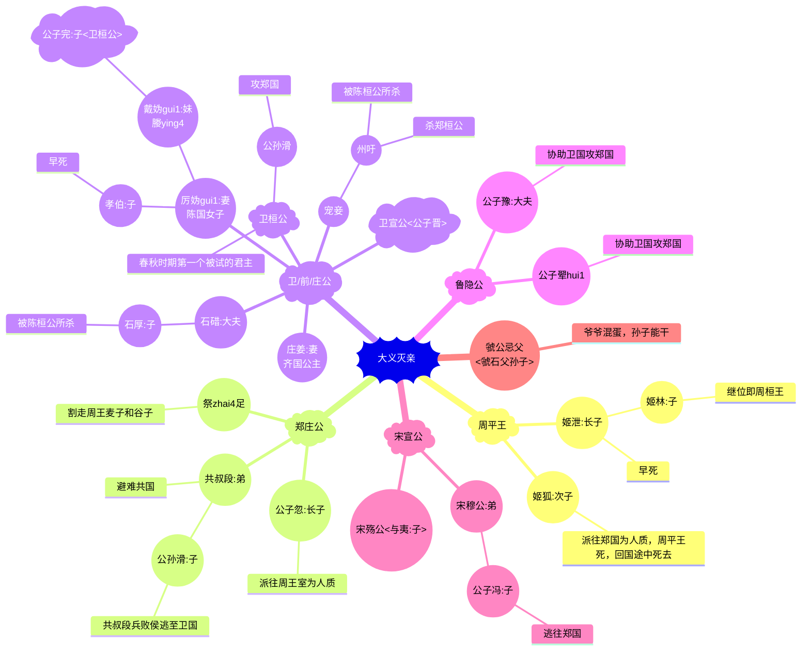
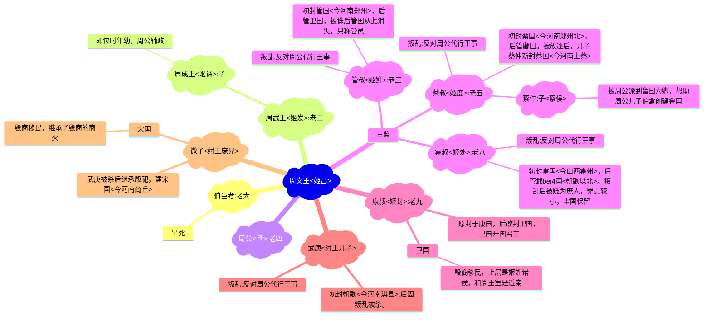

## 透过地理看历史（春秋篇）
### 第三章 大义灭亲

```mermaid
---
config:
  themeCSS: '
    .grid .tick line{stroke:lightgray;stroke-dasharray:3;opacity:1;}
    .grid .tick text{font-size:16px;}
    .grid path {stroke-width: 0;}
  '
  gantt:
    titleTopMargin:
    topPadding:
    gridLineStartPadding: 
    topAxis: true
    barHeight: 50
    rightPadding:
    leftPadding: 200
    fontSize: 16
    sectionFontSize: 20
    numberSectionStyles: 4
    axisFormat: "%Y"
    useMaxWidth:
    weekday:
    barGap:
---
gantt
  dateFormat X
  axisFormat %s
  todayMarker off

  section 大义灭亲
  郑庄公(前743～前701)：寤生: -743,-701
  【前721】郑庄公率四国联军攻卫: milestone, -721,
  【前720】周平王驾崩，周郑以太子互换人质: milestone, -720,
  周郑以太子互换人质: milestone, -720,
  宋国内乱，公子冯逃往宋国: milestone, -720,
  周桓王(前719～前697)：姬林: -719,-697
  卫桓公(前734～前719)：姬宜臼: -734,-719
  【前719】公子州吁杀卫桓公: milestone, -719,
  五国伐郑(卫、宋、陈、蔡、鲁): milestone, -719,
  石碏致信陈国大义灭亲杀其子石厚: milestone, -719,
```

```mermaid
mindmap
root))大义灭亲((
  )周平王(
    ((姬泄:长子))
      早死
      ((姬林:子))
        继位即周桓王
    ((姬狐:次子))
      派往郑国为人质，周平王死，回国途中死去
  )郑庄公(
    ((公子忽:长子))
      派往周王室为人质
    ((共叔段:弟))
      避难共国
      ((公孙滑:子))
        共叔段兵败侯逃至卫国
    ((祭zhai4足))
      割走周王麦子和谷子
  )卫/前/庄公(
    ((庄姜:妻<br>齐国公主))
    ((厉妫gui1:妻<br>陈国女子))
      ((孝伯:子))
        早死
      ((戴妫gui1:妹<br>媵ying4))
        )公子完:子<卫桓公>(
    ((宠妾))
      ((州吁))
        杀郑桓公
        被陈桓公所杀
    ((石碏:大夫))
      ((石厚:子))
        被陈桓公所杀
    )卫桓公(
      春秋时期第一个被试的君主
      ((公孙滑))
        攻郑国
    )卫宣公<公子晋>(
  )鲁隐公(
    ((公子豫:大夫))
      协助卫国攻郑国
    ((公子翚hui1))
      协助卫国攻郑国
  )宋宣公(
    ((宋殇公<与夷:子>))
    ((宋穆公:弟))
      ((公子冯:子))
        逃往郑国
  ((虢公忌父<br><虢石父孙子>))
    爷爷混蛋，孙子能干
```

##### 附:卫国来历

```mermaid
mindmap
root)周文王<姬昌>(
  )伯邑考:老大(
    早死
  )周武王<姬发>:老二(
    )周成王<姬诵>:子(
      即位时年幼，周公辅政
  )周公<旦>:老四(
  三监
    )管叔<姬鲜>:老三(
      叛乱:反对周公代行王事
      初封管国<今河南郑州>，后管卫国，被诛后管国从此消失，只称管邑
    )蔡叔<姬度>:老五(
      叛乱:反对周公代行王事
      初封蔡国<今河南郑州北>，后管鄘国。被放逐后，儿子蔡仲新封蔡国<今河南上蔡>
      )蔡仲:子<蔡侯>(
        被周公派到鲁国为卿，帮助周公儿子伯禽创建鲁国
    )霍叔<姬处>:老八(
      叛乱:反对周公代行王事
      初封霍国<今山西霍州>，后管邶bei4国<朝歌以北>。叛乱后被贬为庶人，罪责较小，霍国保留
  )康叔<姬封>:老九(
    原封于康国，后改封卫国，卫国开国君主
    卫国
      殷商移民，上层是姬姓诸侯，和周王室是近亲
  )武庚<纣王儿子>(
    初封朝歌<今河南淇县>,后因叛乱被杀。
    叛乱:反对周公代行王事
  )微子<纣王庶兄>(
    武庚被杀后继承殷祀，建宋国<今河南商丘>
    宋国
      殷商移民，继承了殷商的商火
```