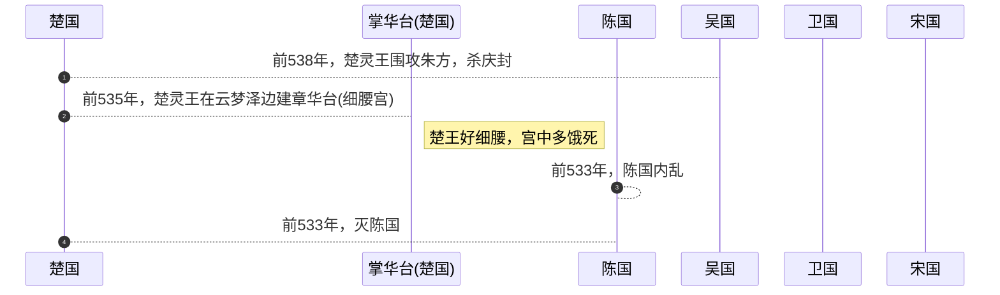

## 透过地理看历史（春秋篇）
### 第三十一章 楚王好细腰

```mermaid
---
config:
  themeCSS: '
    .grid .tick line{stroke:lightgray;stroke-dasharray:3;opacity:1;}
    .grid .tick text{font-size:16px;}
    .grid path {stroke-width: 0;}
  '
  gantt:
    titleTopMargin:
    topPadding:
    gridLineStartPadding: 
    topAxis: true
    barHeight: 50
    rightPadding:
    leftPadding: 200
    fontSize: 16
    sectionFontSize: 20
    numberSectionStyles: 4
    axisFormat: "%Y"
    useMaxWidth:
    weekday:
    barGap:
---
gantt
  dateFormat X
  axisFormat %s
  todayMarker off

  section 时间轴线
  楚灵王(前541～前529)：寤生: -541,-529
  【前538】楚国伐吴，杀庆封: milestone, -538,
  
  【前720】周平王驾崩，周郑以太子互换人质: milestone, -720,
  周郑以太子互换人质: milestone, -720,
  宋国内乱，公子冯逃往宋国: milestone, -720,
  周桓王(前719～前697)：姬林: -719,-697
  卫/前/庄公(前757～前735): -757,-735
  卫桓公(前734～前719)：姬宜臼: -734,-719
  卫宣公(前718～前700): -718,-700
  【前719】公子州吁杀卫桓公: milestone, -719,
  五国伐郑(卫、宋、陈、蔡、鲁)，围东门五天无功而返: milestone, -719,
  石碏致信陈国大义灭亲杀其子石厚: milestone, -719,
  宋宣公(前747～前729): -747,-729
  宋穆公(前728～前720): -728,-720
  【前720】宋穆公死前把位子还给了哥哥宋宣公的儿子与夷(宋殇公): milestone, -720,
  宋殇公(前719～前711): -719,-711
  宋庄公(前710～前692): -710,-692

```

#### 主要事件

```mermaid
---
config:
  themeCSS: '
    .messageText {font-size: 20px;}
  '
  fontSize: 30
  sequence:
    noteAlign: left
    messageFontSize: 20
    noteFontSize: 20
---
sequenceDiagram
  autonumber

  participant 楚国
  participant 掌华台(楚国)
  participant 陈国
  participant 吴国
  participant 卫国
  participant 宋国

  楚国 --> 吴国: 前538年，楚灵王围攻朱方，杀庆封
  楚国 --> 掌华台(楚国): 前535年，楚灵王在云梦泽边建章华台(细腰宫)
  note right of 掌华台(楚国): 楚王好细腰，宫中多饿死

  陈国 --> 陈国: 前533年，陈国内乱
  楚国 --> 陈国: 前533年，灭陈国
  

```
