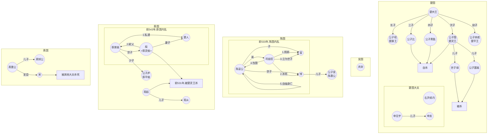

## 透过地理看历史（春秋篇）
### 第三十一章 楚王好细腰

```mermaid
---
config:
  themeCSS: '
    .grid .tick line{stroke:lightgray;stroke-dasharray:3;opacity:1;}
    .grid .tick text{font-size:16px;}
    .grid path {stroke-width: 0;}
  '
  gantt:
    titleTopMargin:
    topPadding:
    gridLineStartPadding: 
    topAxis: true
    barHeight: 50
    rightPadding:
    leftPadding: 200
    fontSize: 16
    sectionFontSize: 20
    numberSectionStyles: 4
    axisFormat: "%Y"
    useMaxWidth:
    weekday:
    barGap:
---
gantt
  dateFormat X
  axisFormat %s
  todayMarker off

  section 时间轴线
  楚灵王(前541～前529): -541,-529
  前538年，伐吴杀庆封: milestone, -538,
  前535年，章华台建成: milestone, -535,
  前533年，灭陈: milestone, -533,
  前531年，灭蔡: milestone, -531,
  前530年，伐徐: milestone, -530,
  前529年，楚灵王自杀: milestone, -529,
  燕惠公(前544～前536): -544,-536
  前539年，燕惠公逃至齐国: milestone, -539,
  燕悼公(前535～前529): -535,-529

```
#### 登场人物

```mermaid
graph TB
  subgraph 楚国
    direction TB
    CCGW((楚共王)) --长子--> CGZZ((公子昭<br>楚康王))
    CCGW((楚共王)) --次子--> CCLW((公子围<br>楚灵王))
    CCGW((楚共王)) --三子--> CGZB((公子比)) --> 自杀
    CCGW((楚共王)) --四子--> CGZHG((公子黑肱)) --> 自杀
    CCGW((楚共王)) --幼子--> CGZQJ((公子弃疾<br>楚平王))

    CCLW --儿子--> CSZL((世子禄)) --> 被杀
    CCLW --儿子--> CGZBD((公子罢敌)) --> 被杀
    CCLW --> 自杀

    subgraph 楚国大夫
      CYYZD((右尹郑丹))
      CSWY((申无宇)) --儿子--> CSH((申亥))
    end

  end

  subgraph 吴国
    WQF((庆封))
  end

  subgraph 陈国
    subgraph 陈国533[前533年,陈国内乱]
      CCAG((陈哀公)) --子--> CL((留))
      CCAG --弟--> CSTZ((司徒招)) --1.照顾--> CL
      CCAG --世子--> CD((悼)) 
      CSTZ --2.杀死--> CD
      CSTZ --3.立为世子--> CL
      CSTZ --4.包围--> CCAG
      CCAG --5.自缢身亡--> CCAG
    end
    CD --儿子--> CGZW((公子吴<br>陈惠公))
  end

  subgraph 蔡国
    subgraph 蔡国543[前543年,蔡国内乱]
      CCJH((蔡景侯)) --世子--> CCLH((般<br/><蔡灵侯>))--妻子--> CCQ((楚人))
      CCJH --1.私通--> CCQ
      CCLH --2.弑父--> CCJH
    end
    CCLH -->  前531年,被楚灵王杀
    CGQ -->  前531年,被楚灵王杀
    CCJH --少子--> CGZL((公子庐<br>蔡平侯))
    CGQ((观起)) --儿子--> CGC((观从))

  end
  
  subgraph 燕国
    YYHG((燕惠公)) --儿子--> YYDG((燕悼公))
    YS((宋)) --> 被其他大夫杀死
    YYHG --宠臣--> YS
  end
```
